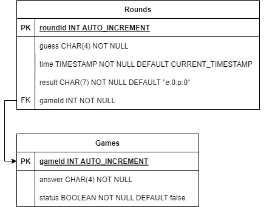

# Guess-The-Number
This is a REST server to facilitate playing a number guessing game known as "Bulls and Cows". 
It is an application where user guesses a number and is told the exact and partial digit matches.
The user wins once the number is guessed with an exact match.

This is the backend only with Java and MySQL, tested using ThunderClient. It is using
* Spring Boot REST application 
* JDBC Template to access the database.

# A Game
* A 4-digit number is generated where every digit is different. 
* The user guesses a number and is told the exact and partial digit matches.
  * An exact match occurs when the user guesses the correct digit in the correct position.
  * A partial match occurs when the user guesses the correct digit but in the wrong position.
* Once the number is guessed (exact matches for all digits) the user wins the game.

# Server rules
* A Game should have an answer and a status (in progress or finished). 
  * While in progress, users should not be able to see the answer. 
* The answer will be a 4-digit number with no duplicate digits.
* Each Round will have a guess, the time of the guess, and the result of the guess in the format "e:0:p:0" 
  * "e" stands for exact matches
  * "p" stands for partial matches.

# REST endpoints:

* "begin" 
  * POST
  * Starts a game, Generates an answer, Sets the correct status. 
  * Return a 201 CREATED message and the created gameId.
* "guess" 
  * POST
  * Makes a guess by passing the guess and gameId in as JSON. 
  * Calculate the results of the guess 
  * Mark the game finished if the guess is correct. 
  * turns the Round object with the results filled in.
* "game" 
  * GET 
  * Returns a list of all games. 
  * in-progress games do not display their answer.
* "game/{gameId}" 
  * GET
  * Returns a specific game based on ID. 
  * in-progress games do not display their answer.
* "rounds/{gameId} 
  * GET
  * Returns a list of rounds for the specified game sorted by time.

# Rough ER Diagram

